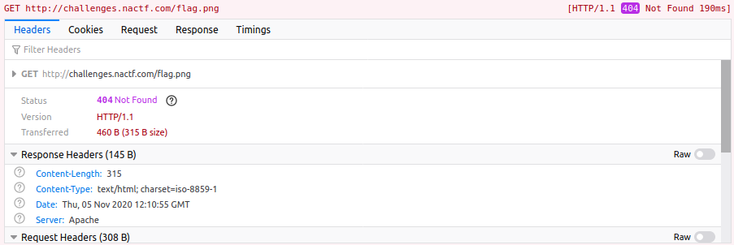
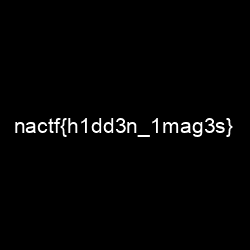

# NACTF

- [NACTF](#nactf)
  - [Reverse Engineering](#reverse-engineering)
    - [Generic Flag Checker® 1](#generic-flag-checker-1)
  - [General Skills](#general-skills)
    - [Basics](#basics)
    - [Grep 0](#grep-0)
    - [Hashbrowns](#hashbrowns)
    - [Arithmetic](#arithmetic)
    - [Zip Madness](#zip-madness)
    - [Grep 1](#grep-1)
    - [World Trip](#world-trip)
  - [Cryptography](#cryptography)
    - [Oligar's Tricky RSA](#oligars-tricky-rsa)
  - [Web](#web)
    - [Inspect](#inspect)
    - [Missing Image](#missing-image)
    - [Forms](#forms)
    - [Calculator](#calculator)
    - [Cookie Recipe](#cookie-recipe)
    - [Login](#login)

## Reverse Engineering
### Generic Flag Checker® 1

The flag is stored directly in the binary and so, running `strings` is enough to get the flag.

```
$ strings ./gfc1
nactf{un10ck_th3_s3cr3t5_w1th1n_cJfnX3Ly4DxoWd5g}
.shstrtab
.note.gnu.build-id
.text
.rodata
```

## General Skills
### Basics

The flag `bmFjdGZ7YmE1MzVfYXIzX3N3MzN0fQ==` is in base64, to decode we can run the following:

```
$ echo "bmFjdGZ7YmE1MzVfYXIzX3N3MzN0fQ==" | base64 -d
nactf{ba535_ar3_sw33t}
```

### Grep 0

We know the flag starts with `nactf`, we just use regex to search:

```
$ grep "^nactf" flag.txt
nactf{gr3p_1s_r3ally_c00l_54a65e7}
```

### Hashbrowns

For this challenge you probably needed to use hashcat or something like that,
but performing a lookup on <https://crackstation.net/> worked. ¯\\_(ツ)\_/¯

The flag turns out to be `nactf{secure_password}`

### Arithmetic

This challenge is a buffer overflow, to get 42 we can just calculate `UINT32_MAX - 2718281828 + 42 + 1`.

```
$ echo "1576685510" | nc challenges.ctfd.io 30165
Enter your number:
flag: nactf{0verfl0w_1s_c00l_6e3bk1t5}
```

### Zip Madness

For this challenge we just needed to extract a matrioshka of zips, reading the direction.
I extracted the `flag.zip` and used the following fish-shell script:

```
#!/usr/bin/env fish
for n in (seq 1000 -1 0)
    set d (cat direction.txt)
    if test "$d" = "left"
        unzip -o "$n"left.zip
    else if test "$d" = "right"
        unzip -o "$n"right.zip
    end
end

$ cat flag.txt
nactf{1_h0pe_y0u_d1dnt_d0_th4t_by_h4nd_87ce45b0}
```

### Grep 1

This time, there are more lines starting with `nactf`, we also have more constraints:
- The first 10 characters after `nactf{` only have the characters `n`, `a`, `c`
- The last 14 characters only have `c`, `t`, `f`
- The length of the whole flag is 52 characters

Our final regex is:
```
$ grep "nactf\{[nac]{10}.{21}[ctf]{14}\}" flag.txt
nactf{caancanccnxfynhtjlgllctekilyagxctftcffcfcctft}
```

### World Trip

Using a reverse geographic API we could just get the countries:
```python
#!/usr/bin/env python3
import requests
import time
header = {
    "User-Agent": "Mozilla/5.0 (X11; Linux x86_64; rv:78.0) Gecko/20100101 Firefox/78.0"
}
flag = ""
with open("enc.txt") as f:
    for line in f.readlines():
        lat, lon = line[1:-2].split(", ")
        resp = requests.get(f"https://api.opencagedata.com/geocode/v1/json?q={lat}+{lon}&key=641c51bed8ab490184632ad8526e29ad&no_annotations=1&language=en", headers=header)
        country = resp.json()["results"][0]['components']['country']
        flag += country[0]
print(f"nactf{{{flag}}}")
```

```
$ python3 solve.py
nactf{IHOPEYOUENJOYEDGOINGONTHATREALLYLONGGLOBALTOURIBOFAIQFUSETZOROPZNQTLENFLFSEMOGMHDBEEIZOIUOCGSLCDYMQYIRLBZKNHHFGBPDIVNBUQQYPDCQIAVDYTRFOCESEQUOUUMSKYJOVKVJGMRGNATNIRESHRKHCEDHHZYQRZVOGCHSBAYUBTRU}
```

## Cryptography

### Oligar's Tricky RSA

We were given `c`, `e`, `n`. We just need to factor `n` into `p` and `q` (using [FactorDB](http://factordb.com/index.php?query=196284284267878746604991616360941270430332504451383)).
Then calculate `phi` to get `d`, and finally we get `m`.

I always refer back to this [video by John Hammond](https://www.youtube.com/watch?v=_lg2AEqRTjg).

```python
#!/usr/bin/env python3
from Crypto.Util.number import inverse
from codecs import ascii_decode

c = 97938185189891786003246616098659465874822119719049
e = 65537
n = 196284284267878746604991616360941270430332504451383

p = 10252256693298561414756287
q = 19145471103565027335990409

phi = (p-1)*(q-1)

d = inverse(e, phi)
m = pow(c, d, n)
print(bytes.fromhex(hex(m)[2:]).decode('utf-8'))
```

## Web

### Inspect

We just need to inspect the site files, the flag is in the `.css` file, as a comment.

```
nactf{1nspect1ng_sp13s_4_lyf3}
```

### Missing Image

Here the site is trying to query `http://challenges.nactf.com/flag.png`, however the correct address is `http://hidden.challenges.nactf.com/flag.png`.





### Forms

Using the following script I found that there is a button that is not like the others.

```python
#!/usr/bin/env python3
import requests
import bs4
from pprint import pprint

url = "https://forms.challenges.nactf.com/"
resp = requests.get(url)
soup = bs4.BeautifulSoup(resp.text, "html.parser")
for b in soup.find_all("button"):
    if b.get('class')[0] != "btn":
        print(b)
```

This yields `btn-flat`, which is:

```html
<button name="submit" id="submit" onclick="verify(); return false;" class="btn-flat" style="background-color:#FFFFFF; color:#FFFFFF">Submit</button>
```

Looking at the `verify` function, we see that submitting the form with `admin:password123` yields the flag:

```js
function verify() {
    user = document.getElementById("username").value;
    pass = document.getElementById("password").value;
    if (user === "admin" && pass === "password123") {
        document.getElementById("submit").value = "correct_login";
    } else {
        document.getElementById("submit").value = "false";
    }
    document.form.submit();
}
```

```
nactf{cl13n75_ar3_3v11}
```

### Calculator

The calculator is running bare bones in a PHP `eval` setting, if we submit `$flag` we get it.
*Kinda guessy if you ask me.*

```
$flag = nactf{ev1l_eval}
```

### Cookie Recipe

The main page stores a cookie in the browser with the `/index.php` Path,
if we change it to `/auth.php` and try to login we get the flag.

```
nactf{c00kie_m0nst3r_5bxr16o0z}
```

### Login

The hint for this challenge is the famous Bobby Tables XKCD, so we just SQL inject the user or password field:

```
' or 1=1 #
```

Getting the flag.

```
flag: nactf{sQllllllll_1m5qpr8x}
```